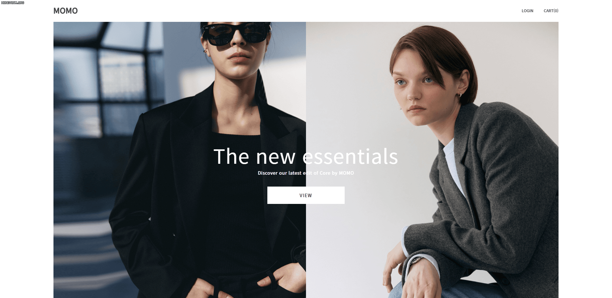
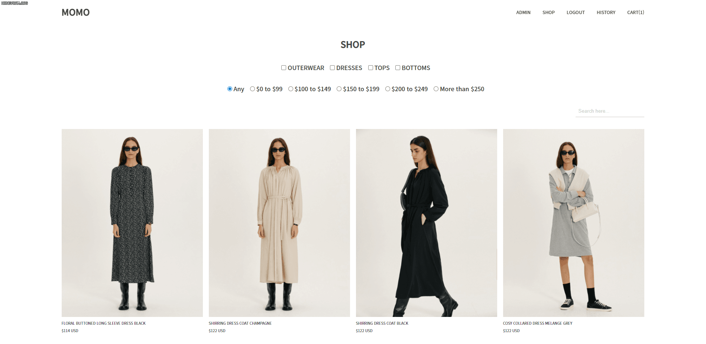
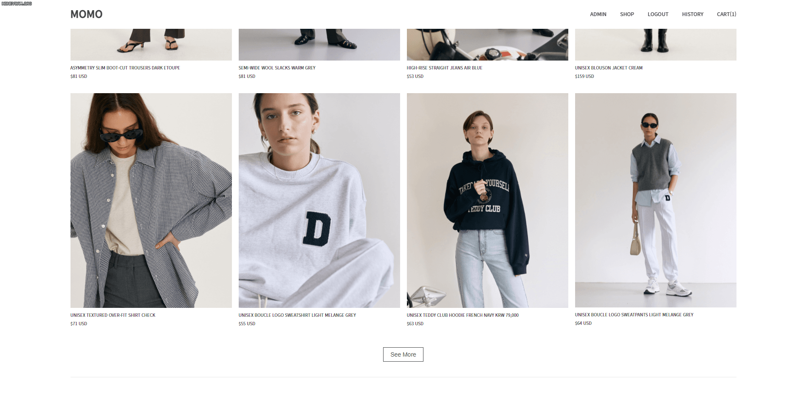
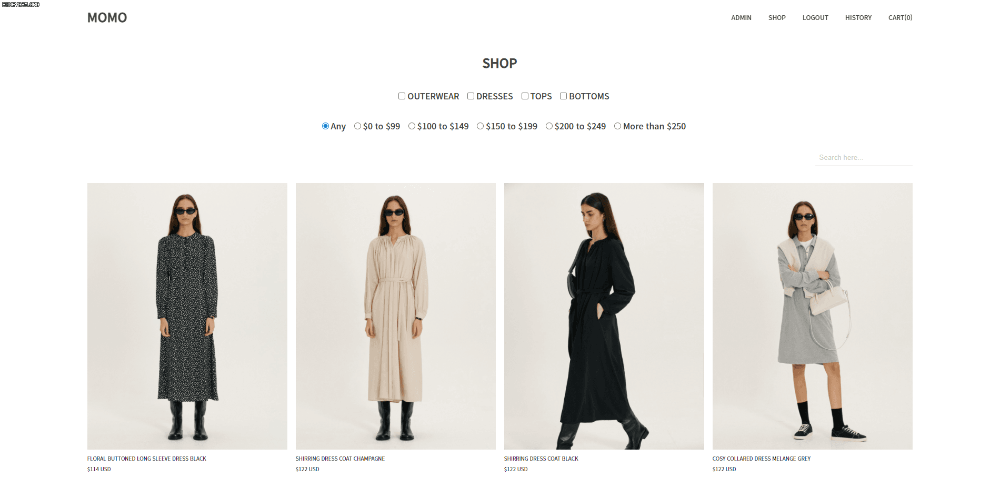
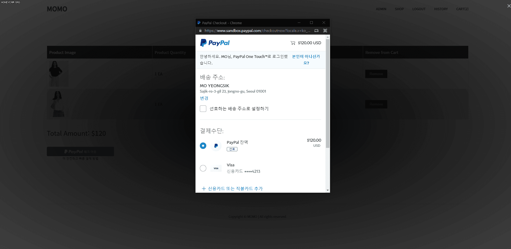
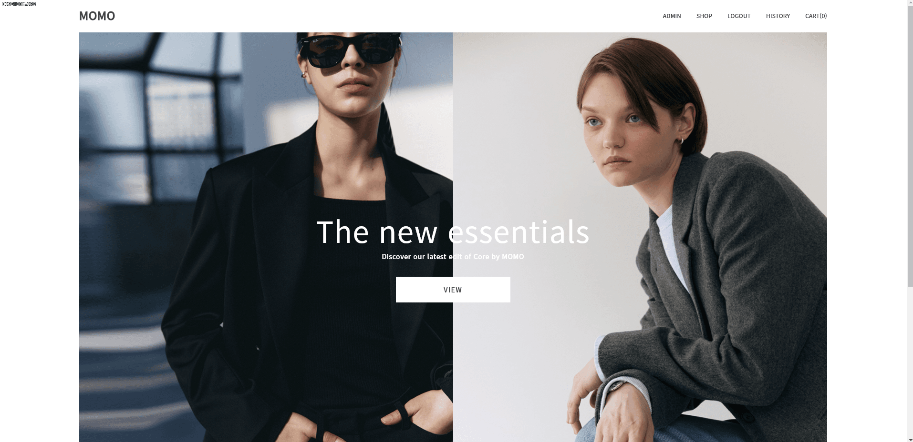
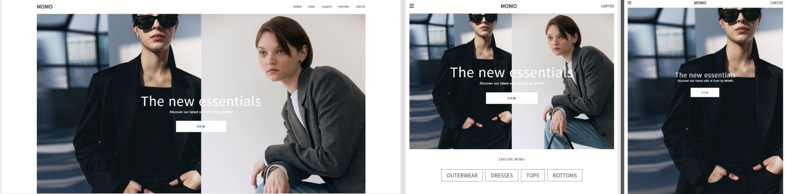

# 🔍 프로젝트 소개

E-commerce 웹 온라인 패션 스토어 서비스 구현 프로젝트 (개인)

배포 : https://storemomo.herokuapp.com

 

## 기술

Front

- React
- Redux, Redux-Saga
- SCSS

Backend

- Node
- Express
- MongoDB, Mongoose

 

## 프로토타입

[Figma](https://www.figma.com/proto/ur1ZiSvRtGqe1Z9PbV9Szk/momo-online-store?node-id=1%3A2&scaling=scale-down&page-id=0%3A1)

 

## 구현기능

### 🎉 회원가입 / 로그인 / 로그아웃

- 회원가입 시 email 중복에 따라 발생하는 문제 기능을 구현하였습니다.
- 로그인 시 email 또는 password 맞지 않았을 때 상황에 따라 대처하는 기능들을 구현하였습니다.

 

### 🎉 SHOP 제품리스트 [체크 박스 필터, 라디오 박스 필터, 검색 기능, 더 보기 버튼 구현]

- 체크 박스 필터(상품 카테고리)와 라디오 박스 필터(가격) 및 검색 기능들을 통해서 해당되는 상품이 배치되도록 구현하였습니다.

 

### 🎉 제품 상세페이지 / 리뷰

- 제품 상세페이지에서 상품 리뷰를 남길 수 있으며, 장바구니에 담을 수 있는 기능을 구현하였습니다.

 

### 🎉 장바구니

- 추가 및 삭제, 주문하기 등의 기능이 가능합니다.

 

### 🎉 결제

- 페이팔 결제 모듈을 통해 결제가 가능하도록 구현하였습니다.

 

### 🎉 관리자 페이지

- Admin 페이지에서 admin 유저는 제품 사진들과, 제목, 설명, 가격, 카테고리를 정하여 제품 페이지에 등록되도록 구현하였습니다.

 

### 🎉 반응형 웹

- 데스크탑, 아이패드, 모바일 순으로 반응형 웹을 구현하였습니다.

 

## 🛒 후기

e-commerce 프로젝트를 통해서 실패를 많이 겪었습니다.

제품 페이지에서 필터 박스를 구현하는 중 제대로 필터링이 되지않는 문제를 겪어 코드를 다시 파악한 후 컴포넌트에서 prop 넘겨받은 것을 usecallback dependency array 넣어줘서 리렌더링 되어도 참조 가능하게 해결하였습니다.

부끄럽지만 헤로쿠에 배포하면서 약 50번만에 성공하였습니다.
mongDB connect 이슈, build시 images들 생성 안되는 이슈, 배포 후 blank screen 이슈 등 다양한 문제들을 겪어 Stack Overflow의 도움을 받아 하나 하나 해결하여 배포하였습니다.

이번 프로젝트를 통해 restful-api에 대한 이해, cookie와 session 그리고 json web token의 각각 장점과 단점, MongoDB를 통한 NoSQL에 대한 이해, Redux를 이용한 상태관리 등 전반적으로 많이 실패해보고 고민하고 해결하며 한 층더 성장할 수 있었던 프로젝트였습니다.
